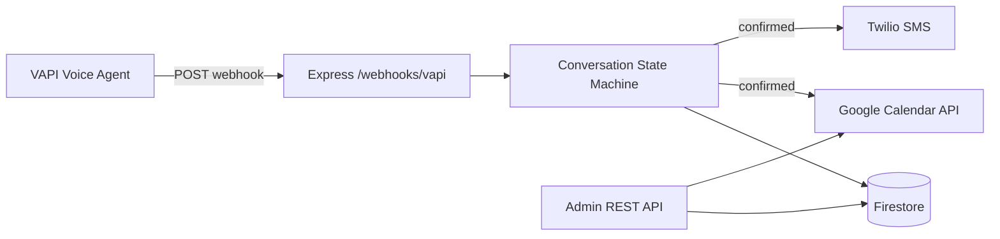

# 🦷 Dental Booking Agent

**Backend for an AI dental receptionist** — handles VAPI call webhooks, a
multi-turn booking flow, Google Calendar scheduling, Twilio SMS confirmations,
and full Firestore logging.

When a patient calls the clinic, VAPI's voice agent posts webhooks to this
service. We walk the caller through **name → service → date/time → confirm**,
persist every turn, then create the calendar event and text a confirmation.

---

## Live demo

- **Base URL:** `https://your-app.up.railway.app` _(update after deploy)_
- **Health check:** `GET /health`
- **Loom walkthrough:** _paste link here_

---

## Architecture



A single webhook endpoint routes on `message.type`. Conversation state is a pure
state machine whose output is persisted to Firestore keyed by `callId`. When the
booking is confirmed, the orchestrator books the calendar slot and sends the SMS.

---

## Features → CORE requirements

| CORE requirement | Implemented by | Endpoint / file |
|------------------|----------------|-----------------|
| 1. Accept VAPI webhooks | Envelope parsing + `message.type` routing | `POST /webhooks/vapi` · `src/routes/webhook.js` |
| 2. Multi-turn conversation | Pure state machine + orchestrator | `src/state/flow.js` · `src/services/conversation.js` |
| 3. Persist state + transcript | Firestore (mock fallback) | `src/services/firestore.js` |
| 4. Google Calendar booking | Service-account `events.insert` | `src/services/calendar.js` |
| 5. SMS confirmation | Twilio message on `COMPLETED` | `src/services/sms.js` |
| 6. Admin visibility | API-key protected REST | `GET /admin/*` · `src/routes/admin.js` |

---

## Quick start

```bash
git clone https://github.com/Vishwa2004-wiseman/Dental-Appointment-Booking-Agent.git
cd Dental-Appointment-Booking-Agent    # or dental-booking-agent/
cp .env.example .env
npm install
npm run dev
```

**Try it with zero credentials.** The app auto-enables **mock mode** when
Firestore isn't configured, so you can exercise the whole flow offline:

```bash
node scripts/test-flow.js   # state-machine unit tests (no deps, no creds)
npm run simulate            # full in-process booking, name → service → time → confirm
```

`npm run simulate` walks a real conversation and prints the session, the created
booking (calendar event id + SMS sid), and a pass/fail checklist.

---

## Environment setup

Copy `.env.example` → `.env` and fill in the values below.

| Group | Vars | Where to get them |
|-------|------|-------------------|
| Firestore | `FIREBASE_PROJECT_ID`, `FIREBASE_CLIENT_EMAIL`, `FIREBASE_PRIVATE_KEY` | [Firebase Console](https://console.firebase.google.com) → Project Settings → Service accounts → *Generate new private key* |
| Calendar | `GOOGLE_CALENDAR_ID` (+ optional `GOOGLE_SERVICE_ACCOUNT_JSON`) | [Google Calendar](https://calendar.google.com) settings → *Integrate calendar*; share the calendar with the service-account email |
| Twilio | `TWILIO_ACCOUNT_SID`, `TWILIO_AUTH_TOKEN`, `TWILIO_PHONE_NUMBER` | [Twilio Console](https://console.twilio.com) |
| VAPI | `VAPI_WEBHOOK_SECRET` (optional) | [VAPI dashboard](https://vapi.ai) → Server URL secret |
| Admin | `ADMIN_API_KEY` | Any long random string you choose |

> **Private-key tip:** paste `FIREBASE_PRIVATE_KEY` in quotes with literal `\n`
> for newlines. The config layer converts them back to real newlines.

---

## API reference

### `POST /webhooks/vapi`
The VAPI [Server URL](https://docs.vapi.ai/server-url). Always responds `200`.
Routes on `message.type`:

| `message.type` | Behaviour |
|----------------|-----------|
| `tool-calls` | Runs booking tools, returns `{ results: [{ toolCallId, result }] }` |
| `conversation-update` | Advances the state machine from the latest user turn |
| `end-of-call-report` | Archives the full transcript to Firestore |
| `assistant-request` | Optional dynamic assistant routing |

### `GET /health`
Liveness + integration status (`firestore`/`calendar`/`sms` = `live` or `mock`).

### `GET /admin/bookings` · requires `X-Admin-Key`
Confirmed bookings for the clinic.

### `GET /admin/sessions` · requires `X-Admin-Key`
All sessions (summary view).

### `GET /admin/sessions/:callId` · requires `X-Admin-Key`
Full session detail: stage, slots, `stateHistory`, and `conversationLog`.

```bash
curl -H "X-Admin-Key: $ADMIN_API_KEY" https://your-app.up.railway.app/admin/bookings
```

---

## Testing locally

```bash
npm test          # 36 zero-dependency assertions: state machine, VAPI parsing, orchestrator, tool-calls, cancel
npm run simulate  # boots the app and drives a full VAPI-shaped conversation
```

CI runs `npm test` on every push (`.github/workflows/ci.yml`).

---

## Deployment

The repo ships deploy configs for every platform the assignment allows, plus Docker:

| Platform | Config | Notes |
|----------|--------|-------|
| **Railway** | `railway.json`, `Procfile` | New Project → Deploy from GitHub repo → add env vars |
| **Render** | `render.yaml` | New → Blueprint → point at the repo; set secret env vars |
| **Vercel** | `vercel.json` + `api/index.js` | Serverless wrapper around the Express app |
| **Docker** | `Dockerfile`, `.dockerignore` | `docker build -t dba . && docker run -p 3000:3000 --env-file .env dba` |

On the graded deploy set every credential and **`MOCK_MODE=false`**, then confirm
`GET /health` reports `firestore: live`, `calendar: live`, `sms: live`. Copy the
public domain into `BASE_URL` and into your VAPI assistant's Server URL.

### Wiring VAPI
Ready-to-paste assistant + tool definitions live in [`vapi/`](vapi/), and real
webhook envelopes for `curl`/Postman live in [`sample-payloads/`](sample-payloads/).
Run `npm run smoke` (with `BASE_URL` set) to exercise the deployed URL end-to-end.

---

## Project structure

```
dental-booking-agent/
├── content.md              # Master build guide (private playbook + Loom script)
├── README.md               # This file
├── package.json
├── railway.json            # Start command + health check
├── .env.example
├── .gitignore
├── src/
│   ├── index.js            # Express app entry
│   ├── config/             # env validation + mock-mode decision
│   ├── routes/
│   │   ├── webhook.js      # POST /webhooks/vapi
│   │   └── admin.js        # GET /admin/bookings, /admin/sessions/:id
│   ├── services/
│   │   ├── conversation.js # orchestrator: state → calendar → sms
│   │   ├── calendar.js     # Google Calendar API
│   │   ├── sms.js          # Twilio
│   │   └── firestore.js    # persistence + queries (mock fallback)
│   ├── state/
│   │   └── flow.js         # pure state machine: name → service → datetime → confirm
│   └── middleware/
│       └── errorHandler.js
├── scripts/
│   ├── simulate-webhook.js # local end-to-end without VAPI
│   ├── test-flow.js        # 36 zero-dependency tests (npm test)
│   └── smoke-live.sh       # end-to-end smoke test against a deployed URL
├── vapi/                   # assistant + tool definitions to paste into VAPI
├── sample-payloads/        # real VAPI webhook envelopes for curl/Postman
├── api/index.js            # Vercel serverless entry
├── Dockerfile · render.yaml · vercel.json · railway.json · Procfile
└── .github/workflows/ci.yml
```

`src/vapi/parse.js` holds the pure, unit-tested envelope parsing used by the webhook.

---

## Scaling notes (toward 1,000 clinics)

- **Every Firestore document carries a `clinicId`**, so a single deployment
  partitions cleanly per clinic; map inbound phone numbers → clinics at the edge.
- **Express instances are stateless** — all conversation state lives in
  Firestore, so you scale horizontally by adding Railway replicas with no sticky
  sessions or in-memory store to synchronise.
- **One Google service account** books into a per-clinic calendar
  (`GOOGLE_CALENDAR_ID`), and the webhook always returns `200` so VAPI never
  retry-storms during a spike.

---

## Author + AI disclosure

Built by **Sargunam**. AI-assisted research (VAPI webhook format, Google/Twilio
SDK scaffolding) with Claude; architecture and integration logic were reviewed,
wired together, and tested manually.

## License

MIT
